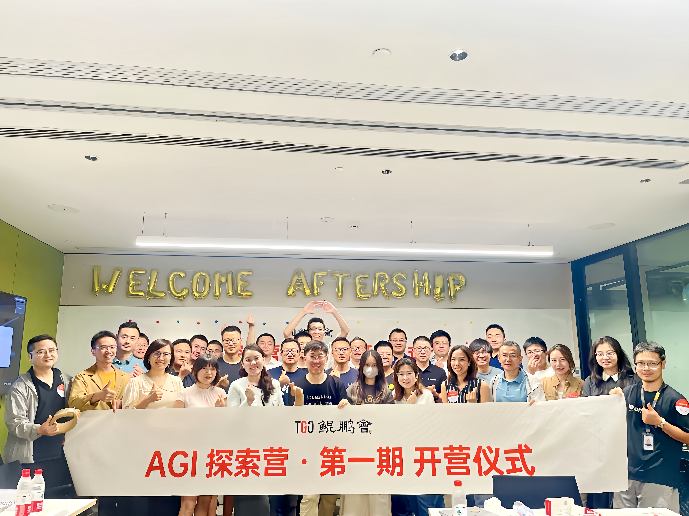
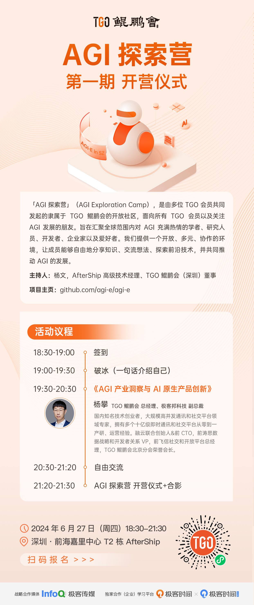
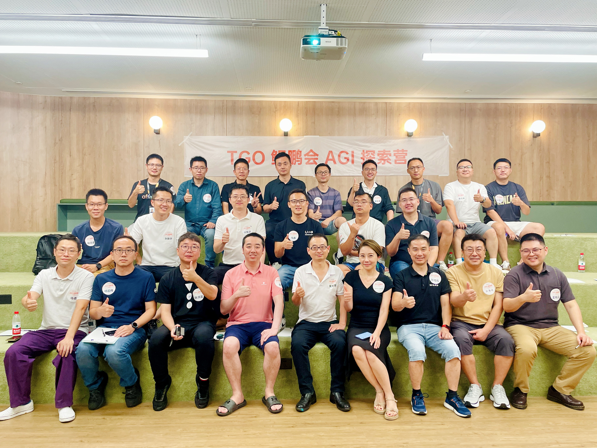
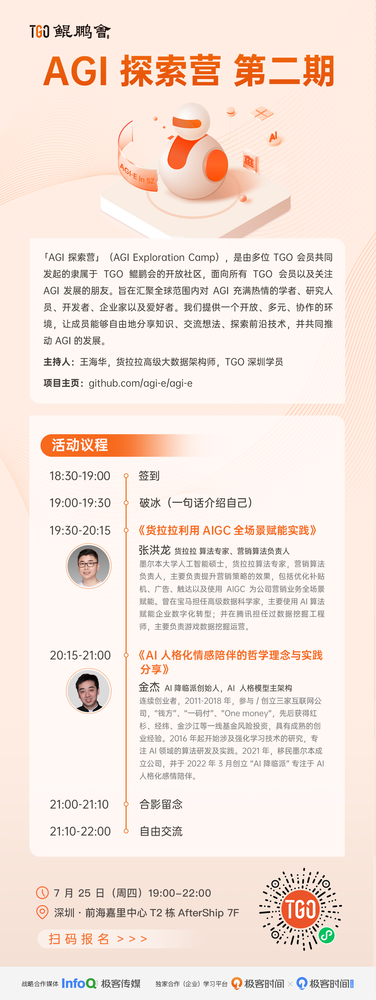
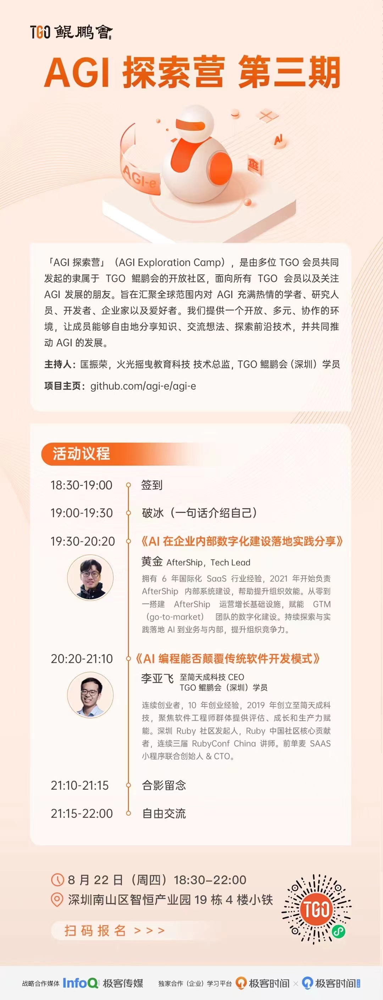
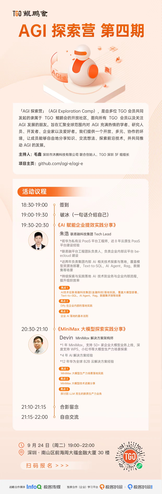

# 「AGI 探索营」

「AGI 探索营」（AGI Exploration Camp），是由多位 TGO 会员共同发起的隶属于 TGO 鲲鹏会的开放社区，面向所有 TGO 会员以及关注 AGI 发展的朋友。旨在汇聚全球范围内对 AGI 充满热情的学者、研究人员、开发者、企业家以及爱好者。我们提供一个开放、多元、协作的环境，让成员能够自由地分享知识、交流想法、探索前沿技术，并共同推动 AGI 的发展。



<p align="center">
  <a href="">申请加入（扫码小程序）</a>
</p>

- 地区：华南地区
- 项目主页：https://github.com/agi-e/agi-e

## 详细介绍

- 使命: 促进 AGI 知识的普及，推动技术交流，加速 AGI 的实践应用。
- 愿景: 为全球领先的 AGI 知识交流和实践平台。

### 主理人

|  *  |  *  |  *  |
| --- | --- | --- |
| 杨文@AfterShip | 王海华@货拉拉大数据基础架构负责人 | 毛鑫@沐腾科技联合创始人 |
| 吴亚昆@塞讯验证技术副总裁 | 匡振荣@阿基米兔技术总监 | 李孟桃@火山引擎架构师 |

### 社区定位

「AGI 探索营」是一个专注于通用人工智能领域的社区，旨在汇聚全球范围内对 AI 充满热情的学者、研究人员、开发者、企业家以及爱好者。我们提供一个开放、多元、协作的环境让成员能够自由地分享知识、交流想法、探索前沿技术，并共同推动 AGI 的发展。

### 主要活动

- **知识分享：** 定期举办线上和线下的讲座、研讨会，邀请领域内的专家和实践者分享最新的研究成果和实践经验。
- **技术交流：** 设立技术讨论群，鼓励成员就 AGI 相关的技术问题进行深入讨论和交流。
- **案例研究：** 分析和讨论 AGI 在不同领域的应用案例，探索其商业和社会价值。
- **项目合作：** 促进成员之间的项目合作，共同开发和实施 AGI 相关的创新项目。
- **资源库：** 建立一个丰富的资源库，包括学术论文、技术文档、工具和教程等。

### 成员构成

- 学术研究人员
- 技术开发者
- 行业专家
- 企业家
- 学生和爱好者

## 加入我们

我们欢迎任何对 AGI 感兴趣的人士加入「AGI 探索营」。无论您是 AGI 领域的资深专家，还是刚刚开始探索这个领域的新手，这里都有您的位置。**让我们一起探索未知，共创未来!**

## 线下沙龙参会须知

1. 每次活动参与人数限额 20-30 人，名额有限，先报先得。TGO 鲲鹏会会员、AI 创业者优先。
2. 为保证现场参会体验，所有参会者需预付活动保证金 200 元，迟到、缺席或早退者，200 押金不退还，纳入活动经费；按时参加活动后，原路退还保证金。
3. 非 TGO 鲲鹏会学员的参会标准为： AI 从业人员，或者具备 3 年以上团队管理经验、所管理团队人数超过 20 人的技术管理者，如 CTO、技术 VP、首席架构师、技术总监或具有技术背景的 CEO 等。

-----

## 线下沙龙记录

| 序号 |   主题     |  主持人/组织者  |    日期    |
| --- |---------- |-------------- |---------- |
| 1 | 《AGI 产业洞察与 AI 原生产品创新》，杨攀，极客邦副总裁 | 杨文 | 2024 年 6 月 27 日（周四） |
| 2 | 《货拉拉利用 AIGC 全场景赋能实践》 & 《AI 人格化情感陪伴的哲学理念与实践》 | 王海华 | 2024 年 7 月 25 日（周四） |
| 3 | 《AI 在企业内部数字化建设落实践分享》&《AI 编程能否颠覆传统软件开发模式》 | 尹振荣 | 2024 年 8 月 22 日（周四） |
| 4 | 《AI 赋能企业内部数字化建设实践》&《MiniMax 大模型探索实践》 | 毛鑫 | 2024 年 9 月 24 日（周二） |
| 5 | 《出海企业对 AI 能力的思考和应用实践》&《AI 驱动的企业效能提升实践分享》&圆桌讨论《AI 助力企业内部研发提效》（闭门邀请制） | 李孟桃 | 2024 年 11 月 16 日（周六） |

## 「AGI 探索营」线下沙龙海报和活动信息

### 「AGI 探索营」第一期

- 主持人：杨文
- 活动页：https://tgo.infoq.cn/event/1330

```
⏰ 时间：2024 年 6 月 27 日 (周四) 19:00-21:30
📍 地址：深圳市南山区前湾嘉里中心 T2 栋 4 楼

📝 议程：
18:30-19:00 签到
19:00-19:30 破冰 (一句话介绍自己)
19:30-20:30 《AGI 产业洞察与 AI 原生产品创新》 杨攀，极客邦副总裁
20:30-21:20 自由交流
21:20-21:30 「AGI 探索营」开营仪式+合影
```

| 合照 |    海报     |
| --- | ----------- |
|  |  |

### 「AGI 探索营」第二期

- 主持人：王海华
- 活动页：https://tgo.infoq.cn/event/1373

```
⏰ 时间：2024 年 7 月 25 日 (周四) 19:00-21:30
📍 地址：深圳市南山区前湾嘉里中心 T2 栋 4 楼

📝 议程：
18:30-19:00 签到
19:00-19:30 破冰 (一句话介绍自己)
19:30-20:45 《货拉拉利用 AIGC 全场景赋能实践》

张洪龙 货拉拉算法专家，营销算法负责人

*墨尔本大学人工智能硕士，货拉拉算法专家，营销算法负责人，主要负责提升营销策略的效果，包括优化补贴机、广告、触达以及使用AIGC为公司营销业务全场景赋能。
*曾在宝马担任高级数据科学家，主要使用 AI 算法赋能企业数字化转型；
*曾在腾讯担任过数据挖掘工程师，主要负责游戏数据挖掘运营。

20:50-21:45 《AI 人格化情感陪伴的哲学理念与实践分享》

金杰 AI 降临派创始人，AI 人格模型主架构

*连续创业者，2011-2018年，参与/创立三家互联网公司，“钱方”、“一码付”、“One money”，先后获得红杉、经纬、金沙江等一线基金风险投资，具有成熟的创业经验。
*2016年起开始涉及强化学习技术的研究，专注AI领域的算法研发及实践。
*2021年，移民墨尔本成立公司，并于2022年3月创立“AI降临派” 专注于 AI 人格化感情陪伴。
21:45-21:50 合影
21:50-22:00 自由交流
```

| 合照 |    海报     |
| --- | ----------- |
|  |  |

### 「AGI 探索营」第三期

- 主持人：尹振荣
- 活动页：https://tgo.infoq.cn/event/1394

```
⏰ 时间：2024 年 8 月 22 日 (周四) 19:00-21:30
📍 地址：深圳南山区智恒产业园 19 栋 4 楼（小铁）

📝 议程：
18:30-19:00 签到
19:00-19:30 破冰 (一句话介绍自己)
19:30-20:20  《AI在企业内部数字化建设落实践分享》

黄金，Aftership，Tech Lead

*拥有 6 年国际化 SaaS 行业经验，2021年开始负责 AfterShip 内部系统建设，帮助提升组织效能。
*近两年负责从零到一搭建 AfterShip 运营增长基础设施，以及赋能 GTM（go-to-market） 团队的数字化建设。
*持续探索与实践落地 AI到业务与内部，提升组织竞争力。

20:20-21:20  《AI编程能否颠覆传统软件开发模式》

李亚飞，至简天成科技，CEO

*连续创业者，10年创业经验，2019年创立至简天成科技，聚焦软件工程师群体提供评估、成长和生产力赋能。
*深圳 Ruby 社区发起人，Ruby 中国社区核心贡献者，连续三届 RubyConf China 讲师。
*前单麦 SAAS 小程序联合创始人 & CTO。
21:10-21:15 合影留念
21:15-22:00 自由交流
```

| 合照 |    海报     |
| --- | ----------- |
|  |  |

### 「AGI 探索营」第四期

- 主持人：毛鑫
- 活动页：https://tgo.infoq.cn/event/1422

```
⏰ 时间：2024 年 9 月 24 日 (周四) 19:00-21:30
📍 地址：深圳市南山区前海周大福金融大厦31楼

📝 议程：
18:30-19:00 签到
19:00-19:30 破冰 (一句话介绍自己)
19:30-20:45 《AI 赋能企业内部数字化建设实践分享》

*亮点1：AI 技术在联易融科技集团(金融科技)落地实践，覆盖大模型部署，Text-to-SQL，AI Agent，Rag，数据集评测等场景
*亮点2：Dify 在企业内部的落地实践
*亮点3：企业 AI 落地的基本法则

朱浩，联易融科技集团 Tech Lead，嘉宾介绍：

*前华为私有云 PaaS 平台工程师，近 8 年云原生 PaaS 平台建设经验
*联易融平台工程团队负责人，负责企业内部云平台 beecloud 建设
*近两年负责集团内部 AI 相关技术探索与落地，覆盖模型资源池部署，Text-to-SQL，AI Agent，Rag，数据集等场景
*持续探索与实践落地 AI 技术到业务与企业内部流程，提升组织效率

20:50-21:30  《MiniMax 大模型探索实践分享》

*亮点1：MiniMax 大模型生产力场景落地实践
*亮点2：MiniMax 大模型技术进展分享
*亮点3：探讨因 LLM 而生的新质生产力业务

Devin，MiniMax 解决方案架构师，嘉宾介绍：

*1 年 MiniMax，支持 50+ 家企业大模型业务上线，深度支持 WPS，小红书等大模型生产力场景探索
*4 年 AI 解决方案经验，12 年华为全球 B2B 云解决方案经验

21:35-22:00 自由交流
```

| 合照 |    海报     |
| --- | ----------- |
|  |  |

### 「AGI 探索营」第五期

- 主持人：李孟桃 火山引擎 架构师
- 活动页：https://tgo.infoq.cn/event/1447

```
⏰ 时间：2024 年 11 月 16 日 (周六) 14:00-18:00
📍 地址：深圳市南山区前海周大福金融大厦

📝 议程：
14:00-14:30 签到
14:30-16:00 《出海企业对 AI 能力的思考和应用实践》 ，神秘大咖

*亮点 1：AI 赋能竞争力:如何通过 AI 驱动企业在出海市场上获得竞争优势
*亮点 2：应用场景解析:分享 AI 在实际业务场景中的成功应用案例与产品实践
*亮点 3：内部提效: AI 技术在企业内部效率提升中的应用场景与案例

16:00-16:15 茶歇

16:15-17:15 《AI 驱动的企业效能提升实践分享》，姚夏冰 联易融科技集团 Tech Lead
- 前腾讯云 TStack 架构师，10 年私有云平台建设经验
- 中国云计算基础架构开发者大会委员
- 联易融研发效能团队负责人，负责企业内部效能平台建设
- 近 2 年负责集团内部 Al Agent 技术探索与落地、AI 提升企业内部流程效率

*亮点 1：个人专属技能: Chrome 插件、指令化集成 Dify AI 应用
*亮点 2：智能会议助理，提升会议效率
*亮点 3：基于个性化汇总的周报自动化系统

17:15-18:00 圆桌讨论《AI 助力企业内部研发提效》(闭门邀请制)，主持人:黄良懿
- TGO 鲲鹏会(深圳)荣誉负责人
- 曾任 OPPO 互联网技术委员会主席、传音控股移动互联 CTO、高仙机器人技术委员会主席
```
